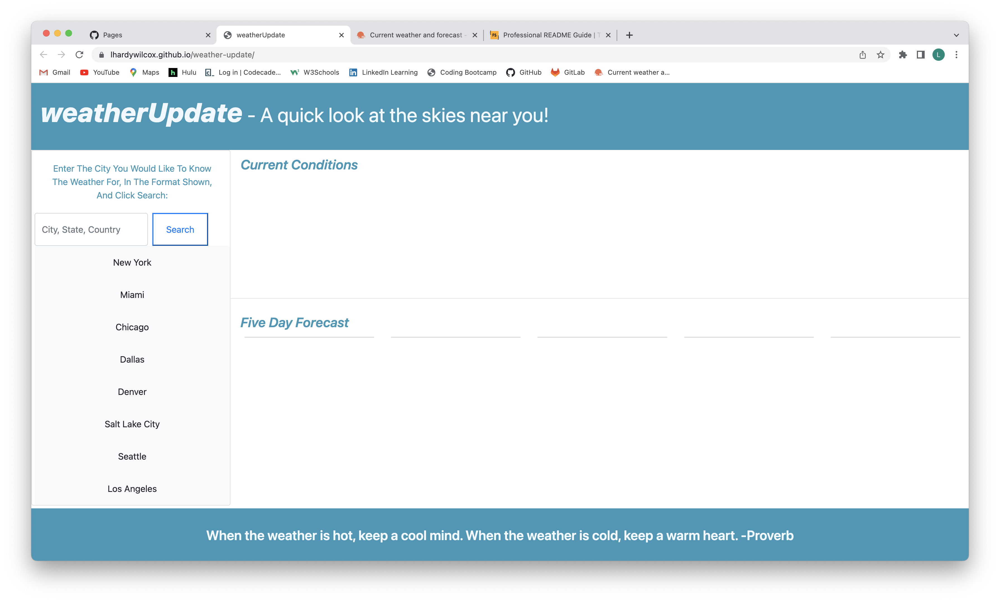
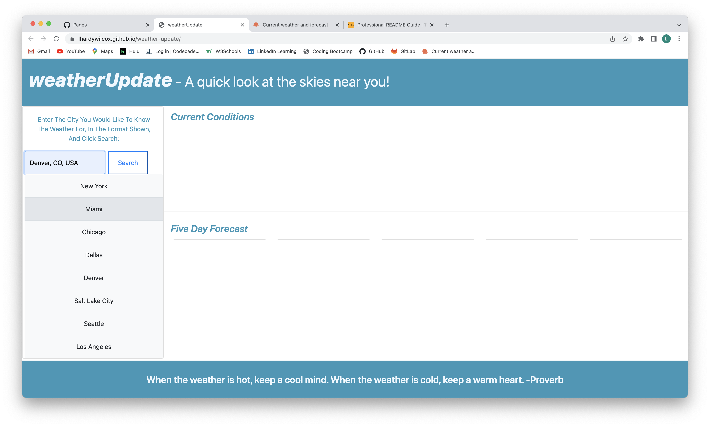
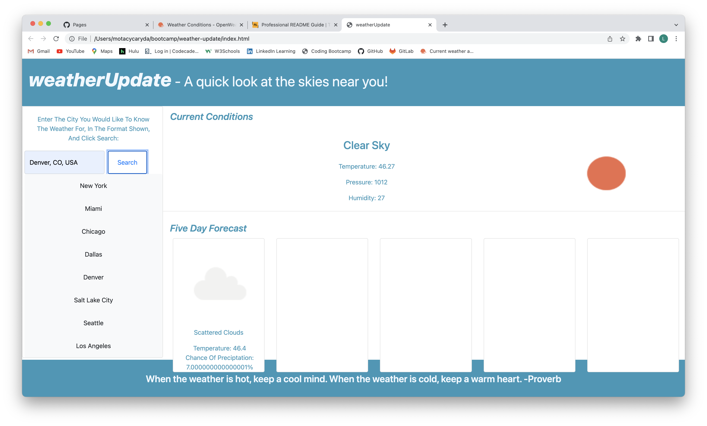

# weather-update

## Description

***weatherUpdate*** is a quick weather app that provides updated current weather and a five day forecast for a location entered by the user.  It draws the location and weather information from OpenWeather APIs that provide latitude and longitude, current weather, and five day forecast information.

This project helped me learn more about using APIs, and also improved my Javascript skills in sorting the information, and dynamically creating the HTML used to display it in the app.  I am espcially pleased at how much of the project came together without assistance, and when I did ask for help, I was able to move farther in the project before needing more assistance.  It shows my growth as a developer well.

I need to complete the coding to display the five day forecast.  I need to understand how to filter the forecast information to properly display it for five days, since the information is given in three hour intervals in the data.  I also need to add the use of local storage, so the user can save commonly used city information.  

An additional feature I would like to add is to turn the city list on the left side into buttons that automatically complete the data call for those cities.  I have the HTML set up to do this, but the Javascript programming will be added in the future.

## Installation

***weatherUpdate*** is a web application deployed at:

[***weatherUpdate*** on github pages](https://lhardywilcox.github.io/weather-update/).

## Usage

To use the app, the user simply enters city, state, and country information in the input blank, using the format displayed.  After clicking on the Search button, the app will populate the Current Weather and Five Day Forecast areas with the chosen city's information.

Below are screenshots of the app:

## Credits

This app was created myself, with help and instruction from a couple teaching assistants.

## License

MIT License
